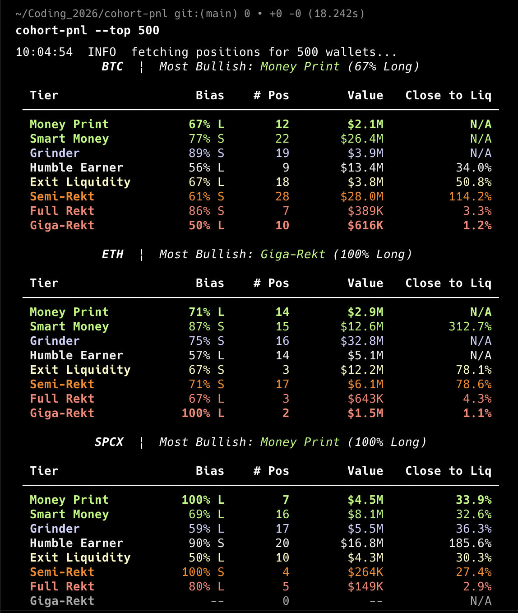
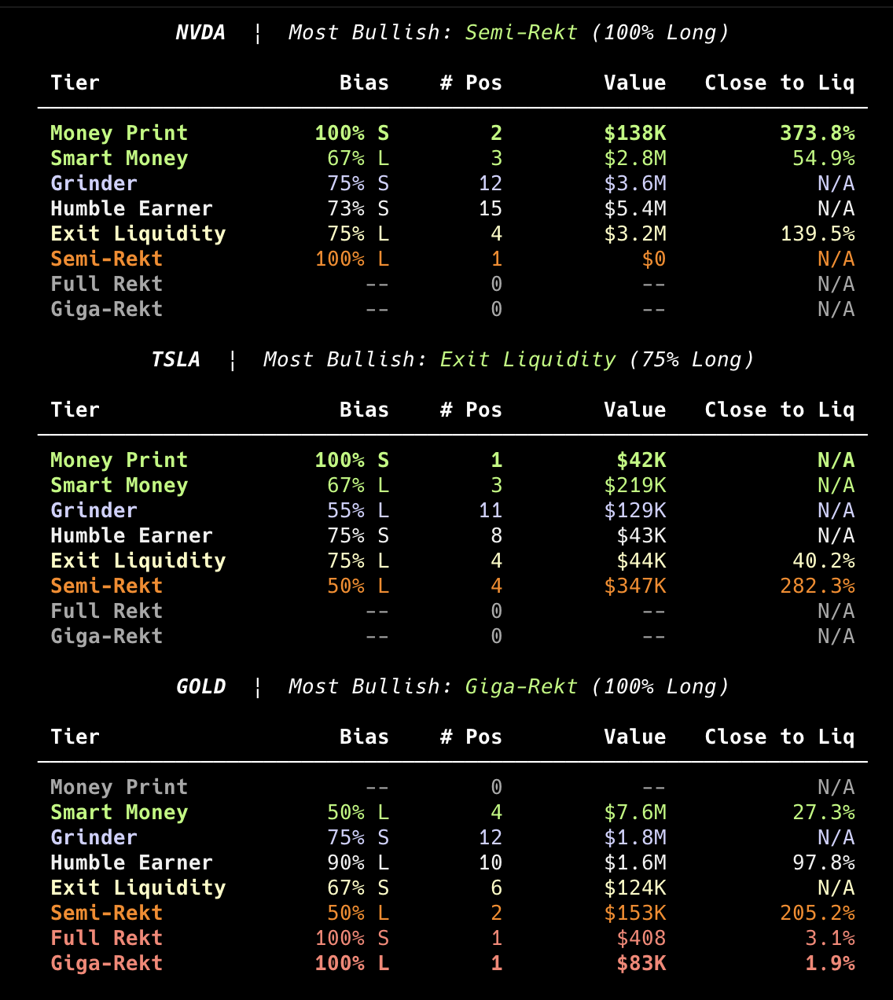

# cohort-pnl

Position breakdown by PNL cohort for Hyperliquid leaderboard wallets.

Replicates the HyperTracker "Position Breakdown by Cohort" panel: wallets
bucketed into named PNL tiers with per-cohort bias (directional lean),
position count, total value, and proximity to liquidation. Covers 7
watchlist assets across native HL perps and the xyz HIP-3 dex.

## Output




*Top 500 leaderboard wallets, `cohort-pnl --top 500`*

---

## Watchlist

`BTC, ETH, SPCX, NVDA, TSLA, GOLD, SILVER`

Configured in `config/watchlist.yaml`. Each wallet is evaluated per
position, not per account -- a wallet long BTC and short SPCX produces
two separate cohort rows.

## Tiers

| Tier | Signal |
|------|--------|
| Money Print | PNL > +50% of margin |
| Smart Money | PNL +10% to +50% |
| Grinder | PNL 0% to +10% |
| Humble Earner | PNL -10% to 0% |
| Exit Liquidity | PNL -30% to -10% |
| Semi-Rekt | PNL < -30% |
| Full Rekt | within 5% of liquidation price |
| Giga-Rekt | within 2% of liquidation price |

Liquidation proximity (Full Rekt / Giga-Rekt) is evaluated before PNL%,
so a highly leveraged position close to liquidation lands there regardless
of its PNL percentage. Boundaries live in `config/tiers.yaml`.

## Coverage

Wallet universe is seeded from the full HL leaderboard
(`stats-data.hyperliquid.xyz/Mainnet/leaderboard`). By default the top
1000 wallets by leaderboard rank are queried.

**Known gap:** wallets that have never appeared on the leaderboard are not
captured. Small or dormant positions will be absent from the output.

## Setup

```bash
pip install -e ".[dev]"
```

Requires Python 3.11+.

## Usage

```bash
# Rich tables to terminal (top 1000 wallets)
cohort-pnl

# Smaller wallet universe
cohort-pnl --top 500

# Full leaderboard (slow, expect rate limiting)
cohort-pnl --top 0

# JSON output
cohort-pnl --json

# Write daily snapshot to SQLite (data/snapshots.db)
cohort-pnl --save

# Raise concurrency (default 20)
cohort-pnl --concurrency 30

# Drill into individual positions for one asset/tier
cohort-pnl --drill BTC --tier "Giga-Rekt"
cohort-pnl --drill SPCX --tier "Semi-Rekt" --tail 10 --sort pnl
```

### Drill mode

`--drill ASSET` fetches the full wallet universe and prints individual position rows for one asset+tier combination. Useful for inspecting which wallets are closest to liquidation or deepest underwater.

| Flag | Default | Description |
|------|---------|-------------|
| `--drill` | (off) | Asset to drill into (BTC, ETH, SPCX, etc.) |
| `--tier` | Giga-Rekt | Tier to show |
| `--tail` | 20 | Max rows to display |
| `--sort liq` | default | Sort by proximity to liquidation |
| `--sort pnl` | | Sort by worst PNL% |

```
cohort-pnl --drill BTC --tier "Giga-Rekt" --concurrency 10
15:44:59  INFO  fetching positions for 1000 wallets...
                             BTC  |  Giga-Rekt  (16 positions, showing 16)

  Wallet            Side          Size     Entry Px      Mark Px       PNL%       Margin     Liq Dist
 ─────────────────────────────────────────────────────────────────────────────────────────────────────
  0xda3cf9...f159   SHORT        0.985   $65,172.00   $65,272.00      -6.1%          $2K         1.1%
  0x21ed86...6995   LONG        12.244   $64,533.20   $65,257.00     +44.4%         $20K         1.2%
  0xbc7617...417c   LONG        50.824   $65,040.00   $65,248.00     +12.7%         $83K         1.4%
  0xdfbdbc...685f   LONG        67.594   $64,977.80   $65,251.00     +16.7%        $110K         1.4%
  0x5d9bd1...8323   LONG         0.382   $65,751.00   $65,257.00     -28.0%         $674         1.5%
  0xfc57c0...7e77   SHORT        3.000   $65,503.00   $65,263.00     +12.9%          $6K         1.6%
  0x9ca4d4...4fb9   SHORT        9.458   $65,620.30   $65,254.00     +22.5%         $15K         1.6%
  0x12f147...807c   SHORT       67.000   $65,912.90   $65,254.00     +40.4%        $109K         1.6%
  0x663c79...2a2f   LONG         0.025   $65,013.00   $65,263.00     +15.3%          $40         1.6%
  0xf1b671...26b3   SHORT        4.000   $64,730.50   $65,264.00     -32.7%          $7K         1.7%
  0x46560b...debd   LONG        12.455   $64,911.40   $65,254.00     +21.0%         $20K         1.7%
  0xda12da...3973   LONG         9.101   $64,914.30   $65,266.00     +18.0%         $18K         1.8%
  0x6d9532...ff14   LONG        16.028   $64,860.50   $65,254.00     +19.8%         $32K         1.8%
  0xd759e8...daf3   LONG         3.959   $64,847.00   $65,269.00     +25.9%          $6K         1.9%
  0xb7be3b...7763   LONG         0.943   $64,805.50   $65,257.00     +22.0%          $2K         1.9%
  0xe81908...3d1c   LONG        17.520   $65,172.20   $65,248.00      +4.6%         $29K         2.0%
```

## Architecture

Two `clearinghouseState` calls are made per wallet:

- **No `dex` param**: native HL perps (BTC, ETH). Coins returned as plain tickers.
- **`dex: "xyz"`**: HIP-3 perps (SPCX, NVDA, TSLA, GOLD, SILVER). Coins returned as `xyz:SPCX`, `xyz:TSLA`, etc. -- the prefix is stripped internally.

Both calls share the same concurrency semaphore.

## Tests

```bash
pytest
```

14 unit and smoke tests. No network access required.

## Snapshot / Bias Trend

`--save` writes one row per `(date, asset, tier)` to `data/snapshots.db`.
The 7-day bias trend is a read query over this table. Run daily via cron
to accumulate history.
